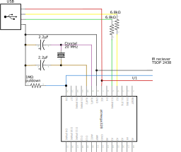

usbremote
=========

A USB infrared receiver for NEC-compatible remotes, built using an AVR micrcontroller. Includes host software using libusb. The host software is written for linux, but can be easily adapted for any other system.

Dependencies
------------

receiver firmware: gcc-avr avr-libc
installation of firmware: avrdude

host-driver: libusb-1.0-0-dev gcc

Compliation and Flashing
------------------------

The firmware using avr-libc and is built using the AVR GCC toolchain. Assuming you have these installed, you can build and flash the firmware onto the device using make:

    make 
    make fuses
    make flash

Building the host software uses clang but can be switched to GCC with minimal changes to the Makefile.

    make

The host software looks for a file /etc/usbremote_commands, which is expected to be in the following format:

    commandcode:command
    0:reboot

Schematic
---------

FIXME: Why is the IR reciever not exporting with the rest of the schematic?

FIXME: How well does this match the [V-USB reference circuit](https://www.obdev.at/products/vusb/index.html)?
       I think there should be some extra diodes & resistors for power smoothing.

Setup for mceusb protocol
=========================

Get mceusb debug messages appearing in dmesg:

    sudo mount -t debugfs debugfs /mnt/dbg/
    echo 'file mceusb.c +p' | sudo tee /mnt/dbg/dynamic_debug/control

In order to make the mceusb drivers actually activate with this device I grabbed a vendor:product ID from mceusb.c and just told this device to use that. I specificaly wanted one for GEN2 and no TX, because I don't want any TX on this device, and why use GEN1 when there's a GEN2 available (note, if there's a GEN3 I should use that instead) this is the one I used:

    Bus 003 Device 052: ID 147a:e017 Formosa Industrial Computing, Inc. eHome Infrared Receiver

This and usb-blink.c was enough to get some mceusb debug messages in dmesg:

    [15536.452505] mceusb 3-1.2:1.0: mceusb_dev_probe called
    [15536.452509] mceusb 3-1.2:1.0: acceptable interrupt inbound endpoint found
    [15536.452511] mceusb 3-1.2:1.0: required endpoints not found

As you can see, it's not actually speaking mce yet, but this first step is significant
