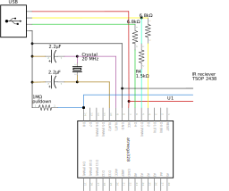

usbremote
=========

A USB infrared receiver for NEC-compatible remotes, built using an AVR micrcontroller. Includes host software using libusb. The host software is written for linux, but can be easily adapted for any other system.

Dependencies
------------

receiver firmware: gcc-avr avr-libc
installation of firmware: avrdude

host-driver: libusb-1.0-0-dev clang

Can we just drop-in replace clang with gcc? Compilation works but does the resulting binary work the same way?

Compliation and Flashing
------------------------

The firmware using avr-libc and is built using the AVR GCC toolchain. Assuming you have these installed, you can build and flash the firmware onto the device using make:

    make 
    make fuses
    make flash

Building the host software uses clang but can be switched to GCC with minimal changes to the Makefile.

    make

The host software looks for a file /etc/usbremote_commands, which is expected to be in the following format:

    commandcode:command
    0:reboot

Schematic
---------

FIXME: Why is the IR reciever not exporting with the rest of the schematic?

FIXME: How well does this match the [V-USB reference circuit](https://www.obdev.at/products/vusb/index.html)?
       I think there should be some extra diodes & resistors for power smoothing.

